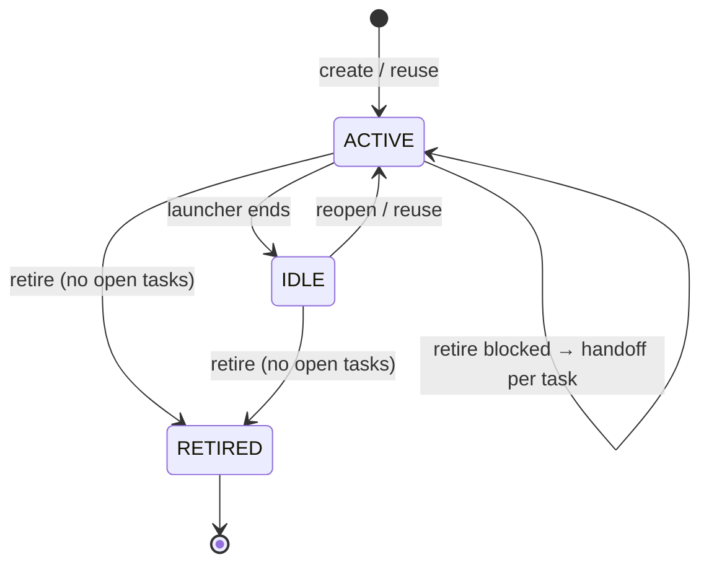

# Lanchu — Architecture

> Concrete design: **surfaces**, **lifecycle**, **identity**, **MCP tools**,
> **resources**, **roles/governance**, **events**. Complements
> [`DEFINITION.md`](./DEFINITION.md) (the why) and
> [`OPEN-QUESTIONS.md`](./OPEN-QUESTIONS.md) (what's still open). It answers: *how does it
> work, exactly?*

---

## 1. The three surfaces

| Surface | What it is | Responsibility |
|-----------|--------|-----------------|
| **CLI / launcher** (`npx lanchu`) | What you run in the terminal. | Onboarding: matches the objective, asks the human the **reuse-or-create** question, picks a role, issues the **identity token**, and keeps the connection alive (= presence). |
| **MCP server** | The shared service the agent connects to (`localhost` HTTP/SSE). | Tools, state (SQLite), roles/governance, event bus, audit. |
| **Web panel** | Supervisor dashboard (local, no auth). | View agents/activity/audit in real time; retire agents with handoff. |

> **Key:** the *"reuse?"* question happens in the **CLI** (interaction with the
> human), it is **not** an MCP tool. The launcher queries candidates and connects the
> session to the chosen durable identity.

---

## 2. Identity, session, and activity (decision A4)

- On startup, the launcher **issues a session token** bound to an `agent_id`. Every MCP
  call travels with that token → the server knows **which agent** each connection is (and
  nobody can impersonate it locally).
- **Presence (active/idle):** while the launcher is alive and connected (SSE open),
  the agent is **ACTIVE**. When the launcher ends (you close the window) → **IDLE**.
- **Activity ("what it's doing now"):** it is **derived from recent tool-calls** (the last
  task claimed/updated, the last doc touched). It does **not** depend on the agent calling
  a heartbeat. Optionally the agent can annotate with `session.note`, but presence and
  activity don't depend on it.

---

## 3. Lifecycle and durable agents

### Session ≠ Agent
- **Agent** = durable identity (role, scope, tasks, *footprint*, history).
- **Session** = a live connection tied to an agent via a token. Ephemeral.

### States



Events: `agent.created` · `agent.reused` · `agent.active` · `agent.idle` ·
`agent.retired`.

### From the objective to the tasks (decision A1)
The launcher registers the objective and **the agent breaks it down into tasks** with `task.create`
(Lanchu doesn't break it down for it). From there on there are concrete tasks to
coordinate around and apply limits to.

### The footprint (reuse by objective)
Each agent accumulates a **footprint**: tasks done, tags/areas touched, context.
On startup with an objective, Lanchu compares against the footprints of the `idle` agents and
returns **candidates** ranked by overlap. *(v0 matching mechanism: tag/keyword
overlap; see [`OPEN-QUESTIONS.md`](./OPEN-QUESTIONS.md).)*

### Safe retirement
Retiring with open tasks **is blocked** until each one is resolved: `task.reassign` to
another agent or `task.release` back to the pool. At the end, `agent.retired`. Nothing orphaned.

---

## 4. Roles and governance (decisions A2, A3)

### Role model
- **Role** = `{ name, allowed_tags: [...] }`, defined by the org (custom). A `*` role
  can touch everything (coordinator).
- **Task** carries `tags: [...]`.
- **Scope rule:** an agent with role *R* can **claim or create** a task *T*
  if `T.tags ⊆ R.allowed_tags`. Otherwise, the action is **rejected** (error) + a
  `scope.violation` event.

### What Lanchu can and can't do (honesty)
Every tool that **mutates** state goes through two steps:
1. **Scope check** against the role and the org's rules → if it violates them, **error**.
2. **Audit logging** of the action (applied *or* rejected), with actor, subject,
   workspace, and cost/tokens **if the agent reports them** (self-reported; Lanchu doesn't measure).

**Real enforcement scope:** the block is hard **only on actions mediated by
Lanchu** (claiming/creating tasks, writing docs). Lanchu **is not an OS sandbox**: it
can't prevent an agent from editing files or running commands on its own. The lane is
**cooperative + auditable**; the trust comes from the fact that **everything stays visible and logged**.
OS-level enforcement is a **non-goal**.

---

## 5. MCP resources (subscribable, read-only)

| URI | Content | Updates when… |
|-----|-----------|----------------------|
| `lanchu://board` | Agents (state, role, objective, open count, workspace) and tasks, with derived **stale**/**reserved** signals (C4). Doc activity is visible in the audit log and docs view. | any `agent.*` / `task.*`. |
| `lanchu://agents` | The org's durable agents and their state. | the lifecycle changes. |
| `lanchu://tasks/mine` | The agent's tasks. | one of its tasks changes. |
| `lanchu://tasks/available` | Tasks whose `tags ⊆ allowed_tags` of the role. | a task is created/released/claimed. |
| `lanchu://task/{id}` | Detail + dependencies + owner. | that task changes. |
| `lanchu://org/roles` | The org's roles and their `allowed_tags`. | the supervisor edits them. |
| `lanchu://docs/{id}` | A shared document. | that doc is updated. |
| `lanchu://me` | The agent's identity, role, scope, and footprint. | they change. |
| `lanchu://audit` | Immutable activity log. | any event occurs. |

Notifications = native MCP (`resources/updated`) with polling (`board.snapshot`) as
backup.

---

## 6. Agent tools (MCP)

### `session.*`
| Tool | Inputs | Notes |
|------|----------|-------|
| `session.whoami` | — | Identity + role + `allowed_tags` + footprint. |
| `session.note` | `text` | Annotates activity (optional). Presence does **not** depend on this. |
| `session.leave` | — | The session ends; the agent goes to **IDLE**. Emits `agent.idle`. |

> There is no `session.register`/`heartbeat`: identity is issued by the **launcher** (§2) and
> presence is derived from the live connection.

### `task.*` — coordination + limits
| Tool | Inputs | Notes |
|------|----------|-------|
| `task.list` | `filter` | *Pull* view. |
| `task.get` | `id` | Detail + owner. |
| `task.create` | `title`, `tags`, `deps?` | The agent structures its plan. Rejected if `tags ⊄ allowed_tags`. Emits `task.created`. |
| `task.check_scope` | `id` | `yours` / `someone_else` / `out_of_role`. |
| `task.claim` | `id`, `workspace?` | **Atomic lock** + role check. Fails if taken or out of role. Emits `task.claimed`. |
| `task.update` | `id`, `status`, `note?` | `done` unblocks dependents and **the response includes a *nudge*** to update the relevant doc (C5). Emits `task.started/blocked/completed`. |
| `task.release` | `id` | Returns to the pool. Emits `task.released`. |
| `task.reassign` | `id`, `to_agent` | Handoff (used in safe retirement). Emits `task.reassigned`. |
| `task.handoff` | `id`, `note` | Explicit handoff with a note, routed by Lanchu (logged). Emits `task.handoff`. |

> `workspace` is generic (a git branch is one case; it can also be a folder, an
> external board, etc.). We don't tie Lanchu to git.

### `doc.*` — living documentation (minimal in v0)
| Tool | Inputs | Notes |
|------|----------|-------|
| `doc.list` / `doc.search` | `query?` | — |
| `doc.read` | `id` | The tools push you to read before acting. |
| `doc.update` / `doc.create` | `id?`, `content` | Controlled by role. Emits `doc.updated`. |

### `org.*` / `board.*`
| Tool | Notes |
|------|-------|
| `org.roles` | The org's roles and their `allowed_tags`. |
| `org.context` | Minimal context per role/task (optimizes tokens). |
| `board.snapshot` | *Pull* backup for clients without subscriptions. |

---

## 7. Events

```
agent.created   agent.reused   agent.active   agent.idle   agent.retired
task.created    task.claimed   task.released  task.started
task.completed  task.blocked   task.reassigned  task.handoff
doc.created     doc.updated
scope.violation
```

**Shape of an event:**
```json
{
  "type": "task.completed",
  "org": "acme", "project": "landing",
  "actor": { "agent": "arregla-login", "role": "frontend" },
  "subject": { "kind": "task", "id": "task-42" },
  "data": { "workspace": "feat/login", "note": "Login done", "tokens": 18240 },
  "timestamp": "2026-07-09T14:30:00Z"
}
```
`tokens` is optional/self-reported. Events feed the panel, MCP notifications, and the
audit log.

---

## 8. Webhooks (shipped)

- **Outbound** — `POST /api/webhooks` registers a URL + event filter (or `*`) + optional
  secret. Every matching event is `POST`ed to the URL, signed with **HMAC-SHA256** in
  `x-lanchu-signature`, at-least-once with backoff. Manage via `lanchu webhooks`.
- **Inbound** — `POST /hooks/intake` creates an unassigned task from a trusted external
  source (optional `x-lanchu-intake-token` when `LANCHU_INTAKE_SECRET` is set).

## 8b. Recurring functions (shipped)

A local scheduler (steady tick) fires **recurring** schedules: each creates an unassigned
task in its project every N minutes, then reschedules. Manage via `lanchu recurring` or
`POST /api/recurring`. Connected agents pick the tasks up like any other — Lanchu
schedules the work, it doesn't run the agents.

### Still roadmap
- **Remote backend**, **skills**, **advanced limits / token budgets** (need a local LLM
  proxy to measure cost). Documented so as not to close the door.

---

## 9. How each pillar is resolved (map to the definition)

| Pillar (DEFINITION.md §3) | Mechanism here |
|--------------------------|----------------|
| **1. Frictionless onboarding** | CLI/launcher (§1) + token-based identity (§2). |
| **2. Durable agents** | Lifecycle + footprint (§3); reuse-or-create; safe retirement with `task.reassign`/`task.release`. |
| **3. Lane + visibility** | Roles with tags + scope check (§4); `task.claim` (lock); `lanchu://audit` + panel; minimal `doc.*`. |
