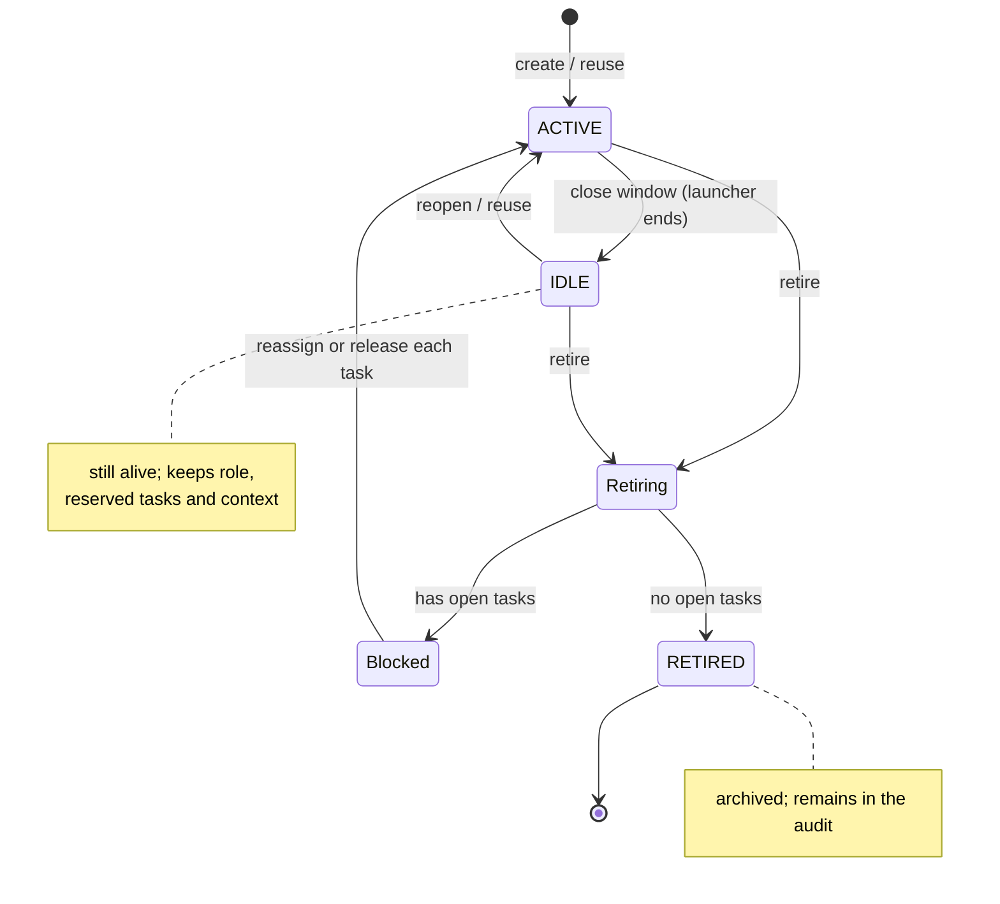
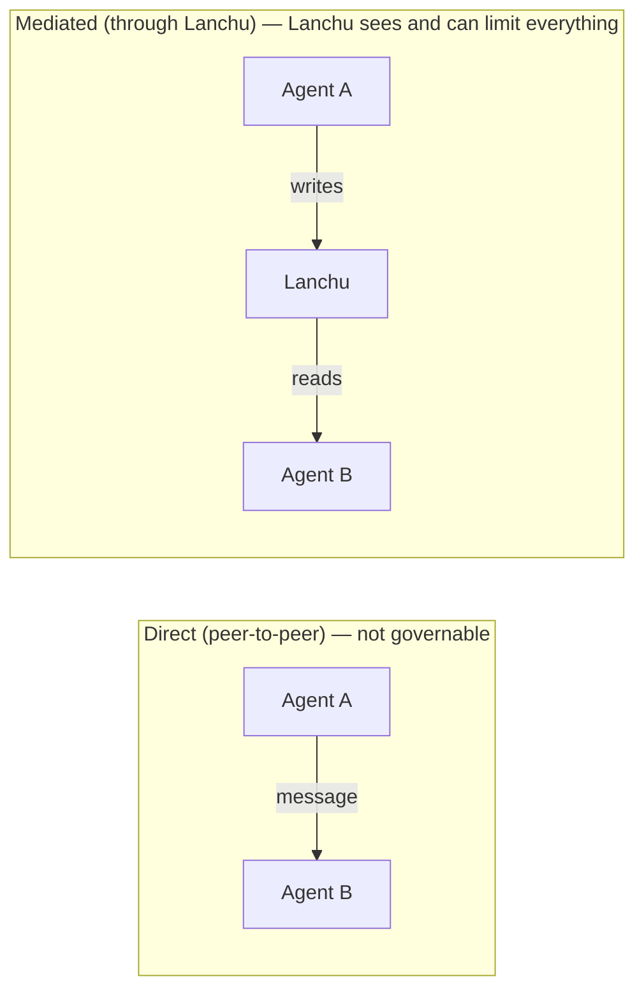

# Lanchu — Project definition

> Definition document. Describes **what problem Lanchu solves, which few
> things it does well, and why it exists**. It's the foundation the rest of
> the project is built on. The technical detail (tools, resources, events, governance) is in
> [`ARCHITECTURE.md`](./ARCHITECTURE.md). The decisions still open, in
> [`OPEN-QUESTIONS.md`](./OPEN-QUESTIONS.md).

---

## 1. Vision

**Lanchu is the control and trust layer for the AI agents you already have
running.**

You open a terminal, run a command, and that agent **joins your organization, takes on
a job, and gets to work** — like just another member of the team. It's not a
throwaway process: **the agent is durable**. You close the window and the agent still exists,
with its role, its work, and its history. When you come back, Lanchu offers to **reuse it**
instead of creating duplicates; and when you retire it, it makes sure that **no one is left
with important work orphaned**.

Meanwhile, each agent stays in its lane (**cooperative, auditable**
limits) and everything it does is **visible and traceable**, so that —even without being
technical— you can *see and trust* what they do.

---

## 2. The problem

When you put several AI agents to work together, two families of pain appear:

**Coordination** — keeping them out of each other's way:
- **Duplicated work.** Two agents solve the same task.
- **Conflicts.** Two agents touch the same resource at once.
- **Blind work.** Agent B doesn't know what A did or when it finished.

**Governance** — keeping them in their lane so you can trust them:
- **No scope limits.** An agent starts something belonging to another, or outside its role.
- **Throwaway agents.** Every window creates a new agent from scratch; the
  context is lost and duplicates pile up.
- **Documentation that rots.** No one guarantees it reflects what was done.
- **Zero visibility and zero trust.** You don't see who did what or what it spent.

Most tools today tackle only **coordination**, and for
developers. Almost no one treats agents as **durable members of a team**
or gives the supervisor **control and trust**. That's the gap Lanchu fills.

---

## 3. The few things we do well

Lanchu doesn't try to do everything. It does **three things**, and it does them well:

| Pillar | What doing it *well* means |
|-------|----------------------------------|
| **1. Frictionless onboarding** | One command (`npx lanchu`) drops an agent into the org with a job and a role. Zero configuration. |
| **2. Durable agents** | They persist as members of the team: reuse-or-create when opening a session, and safe retirement with handoff. **This is the differentiator.** |
| **3. Lane + visibility** | Each agent scoped (cooperative + audited limits), coordinated without duplicating, and everything it does visible (panel + audit). |

Everything else —webhooks, recurring functions, skills, remote backend, sophisticated
panels— is **deliberately "not yet"** (see §10). *Less isn't less: it's doing
few things, done well.*

---

## 4. Durable agents (the heart of Lanchu)

### Session ≠ Agent
- **Session** = one terminal window, one live connection. Ephemeral.
- **Agent** = a **durable** identity with a role, its work, and its history (its
  *footprint*). It persists even if you close the window.

```
   Agent "fix-login"  (durable — lives in the org)
        ├── role / scope (allowed tags)
        ├── tasks: #12 (in progress), #15 (pending)
        ├── footprint: areas it touched, accumulated context
        ├── history / audit
        └── current session: [terminal window]  ← the only ephemeral thing
```

### From the objective to the tasks
You write an **objective** (`npx lanchu 'fix the login'`). From there:

1. The launcher creates (or reuses) an agent and assigns it a **role**.
2. **The agent breaks its objective down into tasks** with `task.create` (each task with its
   tags). *Lanchu doesn't break it down for the agent* — it just gives it the primitive. So the `t=0`
   is no longer empty: there are already tasks to coordinate over and apply limits to.
3. The agent claims the tasks that fall within its role; the ones that don't stay for other roles.

> This is consistent with "unopinionated about the plan": Lanchu **doesn't impose** either the plan or the
> way to break it down. Whoever decides the plan is the agent (or the human), not an engine of
> Lanchu's.

### Lifecycle

On `npx lanchu 'fix the login'`, Lanchu either reuses an idle agent whose footprint
matches the objective, or creates a new one (choose role, break the objective into tasks).



### Reuse-or-create (by objective)
When starting with an objective, Lanchu compares that objective against the **footprint** of the
existing agents. If there's real overlap, it **offers to reuse** the agent that already has
that context instead of creating one from scratch. Reusing is **cheaper** (fewer tokens
re-learning) and **avoids duplicates**.

### Safe retirement
You can't delete an agent and leave its work orphaned. When you retire it, if it has open
tasks, Lanchu **blocks the deletion** and forces you to decide **task by task**:
reassign to another agent or return to the pool. Nothing is lost silently.

---

## 5. Coordination, roles, and limits

### Coordination ≠ orchestration
- **Orchestration** = an engine *decides the plan* and hands it out. **Lanchu is NOT this** (§6).
- **Coordination** = agents **don't collide, don't duplicate, and know what the others are doing**.
  **Lanchu DOES do this.**

Lanchu is **unopinionated about the plan, strict about the limits.** The plan is set by the
agent or the human; Lanchu provides the substrate that makes that concurrent work **safe,
visible, and scoped**.

### *Mediated* coordination, not direct
Agents coordinate **through Lanchu's shared state** (tasks, claims,
docs, events), **not by talking to each other directly**. It's the *blackboard* pattern.



If agents coordinated directly there would be a side channel that Lanchu doesn't see or
can limit → blind governance. Forcing **all** coordination to pass through Lanchu is what
makes it **observable and limitable**. Governance isn't at odds with coordination:
**it requires it mediated.**

### Roles and scope (the "lane")
- A **role** = a name + a list of **allowed tags** (e.g. `frontend → [ui,
  css, components]`). Each org defines it (*custom* roles, not a fixed set).
- A **task** carries **tags** (e.g. `#3 [ui]`).
- **Scope rule:** an agent with role *R* can claim/create a task *T* if the
  tags of *T* are covered by the allowed tags of *R*. If not, the action
  is rejected. A wildcard role (`*`) can touch everything (useful for a coordinator).

### What "limit" means here (and what it doesn't) — honesty
This is central: **Lanchu is not an operating-system sandbox.**

- Lanchu can only reject the actions that **pass through Lanchu** (claiming/creating a
  task, writing a doc). There the block is real and hard.
- Lanchu **cannot physically prevent** an agent from editing a file or running a
  command on its own, outside Lanchu.
- That's why the lane is a **cooperative and 100% auditable limit**: Lanchu blocks the
  mediated and **makes visible and logs everything** — allowed or rejected. Trust comes
  from *seeing everything*, not from imprisoning the process.
- **Non-goal:** Lanchu doesn't pursue enforcement at the OS level (process/file cage).
  That would be huge, OS-specific, and would break "lightweight".

---

## 6. Competitive landscape (why Lanchu exists)

The "multi-agent coordination" space is **saturated**, and we have to be honest:

| Category | Examples | What they do | For whom |
|-----------|----------|-----------|------------|
| **MCP orchestrators** | Agent-MCP, amux | MCP with roles, tasks, locks, dashboard, memory | Advanced devs |
| **Code orchestrators** | Conductor, Claude Squad, Vibe Kanban | Isolate agents in git worktrees | Devs |
| **Frameworks** | LangGraph, CrewAI, AutoGen | Build multi-agent apps in code | Devs |
| **Protocols** | MCP (tools), A2A (agent↔agent) | Interoperability standards | Platforms |

**Agent-MCP** is almost identical to what we could have built, and its docs say it's
*"for advanced developers, with a steep curve by design"*.

**Where Lanchu is different (the wedge):** everyone optimizes **orchestration for
developers**. No one treats agents as **durable members** or gives **control and
trust to whoever supervises**:

- **It sits on top of or alongside** those orchestrators, it doesn't compete with them.
- **The star user is the supervisor**, not the one who writes the plan.
- **Value from 1–3 agents.** A pure coordination board only pays off from
  ~20 agents onward; governance and durability deliver value with few.

---

## 7. The solution

Lanchu is a **lightweight MCP server** that each agent connects to as a shared
service. It exposes primitives for **agent lifecycle**, **mediated coordination**, and
**governance**. The state lives in a **local server with SQLite**, and a **lightweight web
panel** shows it in real time.

### Protocol decision: MCP (not A2A)
- **MCP** is the agent↔service/tools layer: mature and **every agent already speaks it**.
- **A2A** is the agent↔agent layer (delegating between peers): it's *orchestration*, exactly what
  Lanchu is **not**.
- Since Lanchu is a **shared service** that each agent queries, **MCP is the
  correct layer**. Forcing coordination to be mediated by MCP is what **makes
  governance possible**. If direct delegation were ever needed, A2A would be added there.

### Non-negotiable constraints
1. **100% local, no central server.** Everything runs on the user's machine. **Nothing
   leaves it.** It's the trust story that underpins the positioning.
2. **Zero phone-home telemetry.** Lanchu sends nothing. The project's observability
   comes from external sources that already exist (see *Telemetry*).
3. **OS-agnostic.** It runs the same on macOS, Linux, and Windows: (a) `node:sqlite` (no
   native compilation), (b) `localhost` HTTP/SSE transport (to share state between
   sessions), (c) paths via `os`/`path`/`env-paths`, (d) the launcher **connects** the
   agent, it doesn't manage its process.

### Telemetry (without breaking "all local")
| Metric | Source | Own server? |
|---|---|---|
| Downloads / adoption by version | npm API | No |
| Stars / forks / PRs / issues | GitHub API | No |

The **runtime usage** metrics (agents created, org size) live only on the
user's machine and are **deliberately not collected** (they'd break constraint #1).

### Who's who in the v0 (scope honesty)
- The **operator** (semi-technical) sets it up: runs `npx`, connects the agent's MCP client.
- The **supervisor** (may not be technical) observes and trusts via the **panel**.
- The v0 **doesn't** promise that a pure non-technical person sets everything up alone; it does promise they can **supervise** without being one. Automating an entire company (multi-machine) is roadmap (§10).

---

## 8. Domain model

```
Organization
├── Shared documentation (traceable)
├── Roles (name + allowed tags = the limits)
├── Durable agents (active / idle / retired)
│   ├── role + scope
│   ├── footprint (tasks done, areas touched, context)
│   └── current session (ephemeral, with identity token)
└── Projects
    ├── Tasks (state + tags + owner + dependencies)
    └── Audit log (immutable traceability: what it did, touched, and spent*)
```
*The cost/tokens is **self-reported** by the agent (optional): Lanchu doesn't measure it.

---

## 9. Scope of the v0 (MVP)

The **three pillars** from §3, made concrete:

1. **Frictionless onboarding**
   `npx lanchu 'objective'` → creates/reuses agent, chooses role, the agent breaks it down into
   tasks and starts.
2. **Durable agents**
   Session ≠ agent; reuse-or-create by objective; active/idle/retired states; safe
   retirement with task-by-task handoff.
3. **Lane + visibility**
   - Coordination: tasks with atomic claim (no duplicating).
   - Limits: roles with tags; rejection of mediated actions outside role; **everything
     audited** (cooperative, not OS sandbox).
   - Visibility: real-time panel + immutable audit log.
   - **Minimal documentation**: read/write the org's docs, with a change log.

**Technical decisions for the v0:**
- **Stack:** TypeScript + official MCP SDK. Installation with `npx lanchu`.
- **Protocol:** MCP. **Transport:** `localhost` HTTP/SSE.
- **Identity:** the launcher issues a **session token**; presence = live launcher;
  activity is derived from **recent tool-calls** (not from a heartbeat the agent
  has to remember).
- **Execution:** 100% local, no central server, no phone-home telemetry.
- **Portability:** OS-agnostic (`node:sqlite` + abstract paths + launcher that connects).
- **State:** SQLite with an abstract storage layer to migrate to remote later.
- **License:** MIT.

---

## 10. Roadmap (deliberately outside the v0)

- **Webhooks** — integration with external systems (Slack, CI, GitHub).
- **Recurring functions** — turn a useful session into a scheduled function.
- **Skills** — reusable capabilities that agents load.
- **Remote backend** — organizations across machines, with auth (to "automate an
  entire company").
- **Advanced limits** — token/cost budgets per role, quotas, approvals.
- **A2A interoperability** — if agents need to delegate work to each other directly.

---

## 11. Design principles

1. **Few things, done well** — less isn't less; it's focus.
2. **Agents are durable members, not throwaway processes.**
3. **Governance and coordination are two sides of the same thing** — everything passes through Lanchu.
4. **Unopinionated about the plan, strict about the limits.**
5. **Cooperative + auditable limits, not a cage** — trust comes from *seeing
   everything*, not from imprisoning the process.
6. **The supervisor is first-class** — even if not technical, they must *see and trust*.
7. **Nothing orphaned, nothing silent** — reuse instead of duplicate; retire with
   handoff; everything in the audit.
8. **All local, nothing leaves your machine** — no central server, no phone-home.
9. **OS-agnostic** — it runs the same on macOS, Linux, and Windows.

---

## Competitive analysis sources

- [Agent-MCP (GitHub)](https://github.com/rinadelph/Agent-MCP)
- [9 Open-Source Agent Orchestrators (2026)](https://www.augmentcode.com/tools/open-source-agent-orchestrators)
- [AI Agent Orchestration in 2026 (amux)](https://amux.io/guides/ai-agent-orchestration-2026/)
- [MCP vs A2A (Atlan)](https://atlan.com/know/mcp/mcp-vs-a2a-protocol/)
- [A2A surpasses 150 orgs (Linux Foundation)](https://www.linuxfoundation.org/press/a2a-protocol-surpasses-150-organizations-lands-in-major-cloud-platforms-and-sees-enterprise-production-use-in-first-year)
