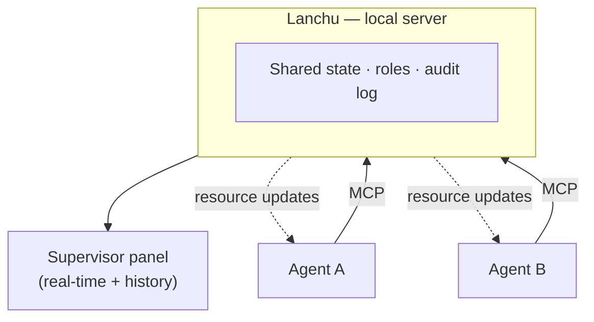

<h1 align="center">Lanchu</h1>

<p align="center">
  <b>The control panel and the limits for the AI agents you already have running.</b><br>
  Coordinate them without collisions. Watch them in real time. Trust what they do.
</p>

<p align="center">
  <a href="https://www.npmjs.com/package/lanchu"></a>
  <a href="https://www.npmjs.com/package/lanchu"></a>
  <a href="https://github.com/lanchuske/lanchu/actions/workflows/ci.yml"></a>
  <a href="https://lanchuske.github.io/lanchu/"></a>
  <a href="./LICENSE"></a>
  
  
  
</p>

<p align="center">
  
</p>

---

## What problem does it solve?

More and more people use several AI agents (like Claude or Cursor) to build
apps or automate their company. But when you put **several agents to work at once**,
two pains show up:

**They don't coordinate** — and they get in each other's way:
- **They step on each other's work** — two agents do the same thing.
- **They work blind** — one doesn't know what the other did.

**You can't control them** — or trust them:
- **They stray out of their lane** — an agent touches something it shouldn't.
- **The documentation goes stale** — nobody keeps the knowledge up to date.
- **You can't see anything** — you don't know who did what, or what they spent.

Most tools only tackle coordination, and they're built for programmers.
**Lanchu adds what's missing: control and trust for whoever supervises.**

Lanchu **does not orchestrate** your agents (it doesn't decide their plan). It gives them a
**shared workspace** so they coordinate without colliding, sets **scope limits** on them, keeps the
**documentation up to date**, and gives you a **panel + history** to *see and trust* what
they do — even if you're not technical.

## How it works (the idea)

1. You launch your agents as always (with the tool you already use).
2. Each agent **registers in your organization and takes on a role**.
3. From there, it only works on **what it's responsible for**: it claims tasks, reads the
   shared documentation, and Lanchu **rejects and records** any action outside its
   lane. The agents coordinate **through Lanchu**, not by talking to each other —
   that's why you can see and bound everything.
4. You watch the **real-time panel**: who's active, what they're working on, what
   documentation they create, and a **history** of everything they did.

> Lanchu sets **cooperative, auditable limits**: it blocks what passes through it and leaves
> **everything in plain sight**. It's not a system cage — the trust comes from *seeing it all*.

## How it fits

Agents coordinate *through* Lanchu (a shared blackboard), never directly with each other —
so every action is visible and can be bounded.



## Quick start

```bash
npx lanchu "fix the login"
```

> **Note:** Requires Node >= 22.5. See [`CHANGELOG.md`](./CHANGELOG.md) for what's new,
> [`DEFINITION.md`](./DEFINITION.md) for the full picture and [`CLI.md`](./CLI.md) for the
> command surface.

## What's included today

**Coordination**

- **Organizations, projects, roles and tasks** — a shared blackboard with scope control;
  actions outside the role are rejected and recorded.
- **Agent isolation** — `lanchu spawn` gives each agent its own terminal, git worktree and
  branch, so parallel work can't collide. `lanchu tile` arranges the terminals into a mosaic.
- **Agent-to-agent messaging with conflict warnings** — audited, never private; idle agents
  with queued notices are woken automatically.
- **SDLC pipeline (assist mode)** — the server owns the lanes (definition → build → review →
  qa → done): attach a PR and the task routes to review; finish it and it routes to QA
  verification. Agents can bounce underspecified tasks back to definition (`task_reject`),
  with the reason audited.

**Governance**

- **Roles you can edit** — tag scopes, wildcard, a per-role token quota (claims warn at 80%,
  block at 100%) and a preferred model tier; `lanchu spawn --model` overrides per spawn.
- **Coordinator lease** — one coordinating agent per org, enforced; the supervisor grants or
  revokes it with `lanchu coordinator`.
- **Greenzone restarts** — `lanchu restart --greenzone` coordinates a maintenance window:
  every agent confirms a safe point before the server goes down.
- **Session security** — per-session Bearer tokens (never in window titles or `ps` args);
  `lanchu rotate-tokens` invalidates every open session after an exposure.

**Knowledge & memory**

- **Shared, traceable documentation** — categorized docs with section and delta reads, read
  tracking and usage analytics.
- **Persistent memory** — three scopes (agent / project / org) stored in the org DB and
  auto-distilled into each agent's context across sessions.

**Observability**

- **Real-time panel** — Overview home (who's working right now), Projects, Team, Work board,
  Org life (a force-directed graph of the org built from the audit log), Bugs, Docs, Memory,
  Tests, Activity, and Processes (server, agent terminals, live MCP transports).
- **Full audit log** — every action, applied or rejected.
- **Terminal comfort** — `lanchu statusline` shows the team's pulse inside Claude Code;
  `lanchu completion install` wires Tab-completion for commands, flags and live board values.

What comes next (recurring functions, skills, cloud organizations…) is in
the [roadmap](./DEFINITION.md#10-roadmap-deliberately-outside-the-v0).

## Who it's for

For anyone who **supervises several agents** working toward a common objective:
to build an app, automate processes, or coordinate a company's work.
Lanchu sits **on top of or alongside** the tools you already use to launch agents.

In this first version there are two roles: an **operator** (semi-technical) who does the
initial setup —running a command, connecting your agents—, and a **supervisor** who
watches and trusts from the panel, **without needing to be a programmer**.

## Contributing

Lanchu is open source and contributions are welcome in a controlled way. Start with the
[project definition](./DEFINITION.md), then the [contributing guide](./CONTRIBUTING.md).
Have an idea? Open a [feature request](https://github.com/lanchuske/lanchu/issues/new?template=feature_request.yml)
or start a thread in [Discussions › Ideas](https://github.com/lanchuske/lanchu/discussions).

- [Code of Conduct](./CODE_OF_CONDUCT.md)
- [Security policy](./SECURITY.md)

## License

[MIT](./LICENSE)
